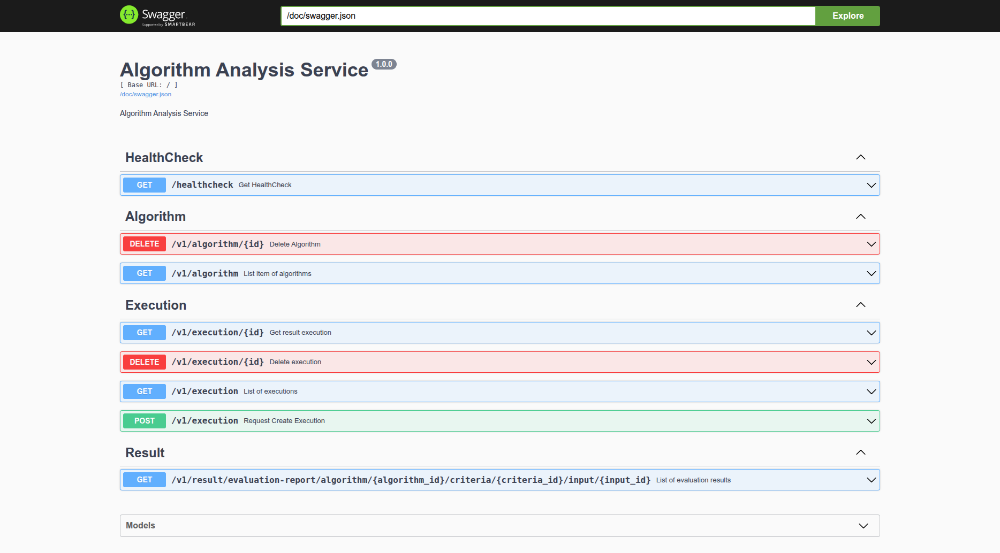
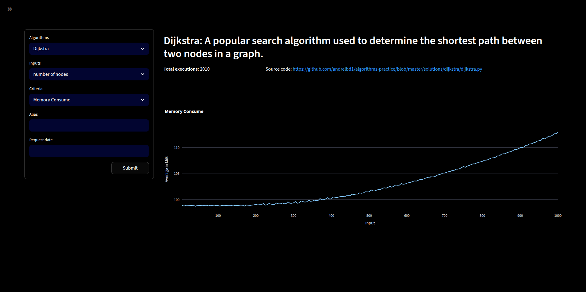
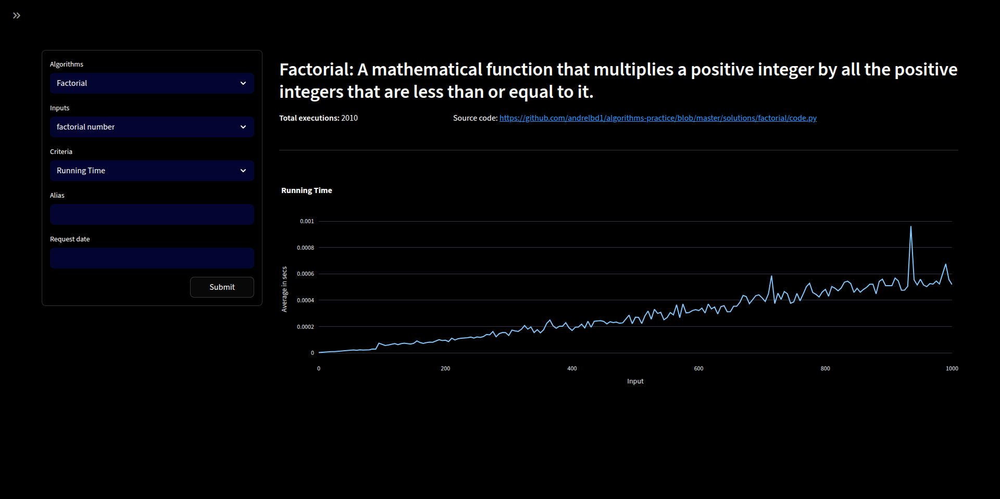
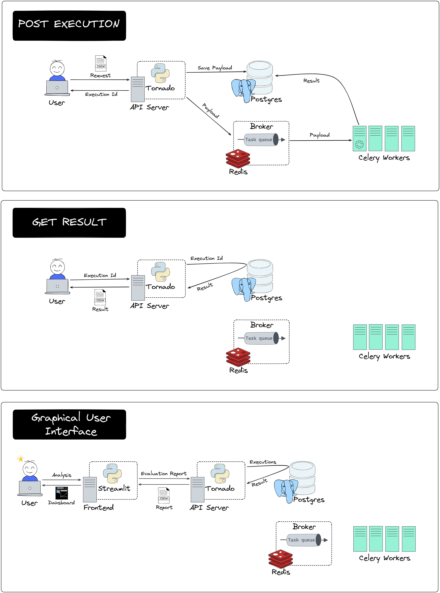
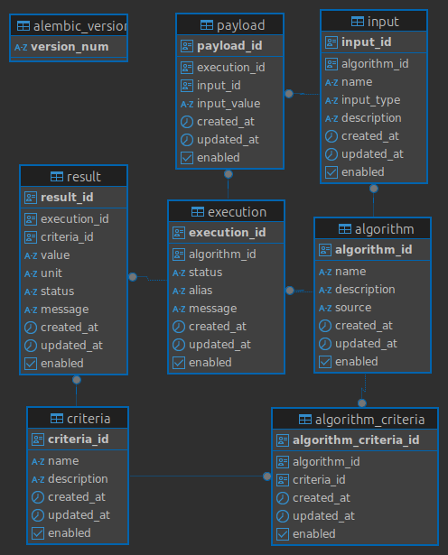

# Algorithm Analysis Service
[](https://github.com/andrelbd1/algorithm-analysis-service) 
[](https://github.com/andrelbd1/algorithm-analysis-service) 

## Overview
This project serves as a sandbox for experimenting with and evaluating various algorithms and development tools.

It features a RESTful API that enables users to execute algorithms and analyze essential performance metrics, including `runtime`, `memory consumption`, `node and edge counts`, and `cycle detection`.

## Prerequisites
- Python 3.12.6
- Required dependencies (see `requirements.txt`)

### Run cover test
```sh
    py.test --cov=src tests
```

## Installation
Clone the repository and start application:
```bash
   git clone https://github.com/andrelbd1/algorithm-analysis-service.git
   cd algorithm-analysis-service
   docker compose up
```

## Usage

Once the application is running, you can access the interactive API documentation via Swagger UI:

- [http://localhost:8001/doc#/](http://localhost:8001/doc#/)

Use this interface to explore available endpoints, execute requests, and review responses directly from your browser.



### Endpoints

The following endpoints are available in this project:

- **GET /healthcheck**  
    Returns the health status of the service.

- **DELETE v1/algorithm/{algorithm_id}**  
    Deletes the algorithm identified by the specified `algorithm_id`.

- **GET v1/algorithm**  
    Retrieves a list of available algorithms.

- **GET v1/execution/{execution_id}**  
    Retrieves the result and details of a specific algorithm execution identified by `execution_id`.

- **DELETE v1/execution/{execution_id}**  
    Removes a specific algorithm execution from the system, identified by the provided `execution_id`.

- **GET v1/execution**  
    Retrieves a list of all algorithm executions, including their statuses and associated metadata.

- **POST v1/execution**  
    Initiates the execution of a specified algorithm. Accepts input parameters in the request body and returns execution details, including a unique `execution_id` for tracking the process and retrieving results.

- **GET v1/result/evaluation-report/algorithm/{algorithm_id}/criteria/{criteria_id}/input/{input_id}**  
    Returns a comprehensive evaluation report that aggregates results based on the specified algorithm, input, and criteria. This endpoint provides detailed insights into the algorithm's performance and evaluation metrics for the given parameters.

### Graphical User Interface (GUI)

You can also visualize algorithm results using the dedicated GUI:

- [http://localhost:8002/algorithms](http://localhost:8002/algorithms)

This Streamlit-based interface lets you interactively explore performance metrics and results. Data is presented through dynamic line charts powered by Plotly, making it easy to compare algorithms and analyze trends visually.





## Communication Diagram



## Entity Relationship Diagram

The following diagram illustrates the core entities and relationships within the system's database schema. It highlights how algorithms, criteria, executions, inputs, payloads, and results are interconnected. This structure enables efficient tracking of algorithm executions, their parameters, evaluation criteria, and resulting outputs.

- **algorithm**: Stores information about each algorithm available in the service.
- **criteria**: Defines evaluation criteria that can be associated with algorithms.
- **algorithm_criteria**: Represents the many-to-many relationship between algorithms and criteria.
- **execution**: Records each execution instance of an algorithm, including status and metadata.
- **input**: Contains input required for each algorithm execution.
- **payload**: Stores payloads for algorithm execution.
- **result**: Captures the results and performance metrics of each execution.

Refer to the diagram below for a visual representation:



## Project Structure
```
.
├── main.py                             # Entry point for executing tasks
├── migrations/                         # Database migration scripts
│   ├── versions/                       # Individual migration versions
│   ├── env.py                          # Alembic environment configuration
├── src/                                # Application source code
│   ├── api/                            # API layer
│   │   ├── v1/                         # Version 1 API endpoints
│   │   │   ├── swagger/                # Swagger documentation
│   │   │   │   ├── __init__.py         # Module initializer
│   │   │   │   ├── algorithm.py        # Swagger docs for algorithms
│   │   │   │   ├── execution.py        # Swagger docs for executions
│   │   │   │   ├── report.py           # Swagger docs for report
│   │   │   ├── __init__.py             # Module initializer
│   │   │   ├── algorithm.py            # Handles algorithm-related API endpoints
│   │   │   ├── execution.py            # Handles execution-related API endpoints
│   │   │   ├── report.py               # Handles report-related API endpoints
│   │   ├── __init__.py                 # Module initializer
│   │   ├── healthcheck.py              # Health check endpoint implementation
│   ├── codes/                          # Algorithm implementations
│   │   ├── dijkstra/                   # Dijkstra's algorithm
│   │   ├── factorial/                  # Factorial algorithm
│   │   ├── fibonacci/                  # Fibonacci algorithm
│   │   ├── __init__.py                 # Module initializer
│   │   ├── base.py                     # Base class for algorithms
│   ├── common/                         # Common utilities and helper functions
│   │   ├── __init__.py                 # Module initializer
│   │   ├── functions.py                # Common helper functions
│   ├── controllers/                    # Business logic for processing tasks
│   │   ├── __init__.py                 # Module initializer
│   │   ├── algorithm.py                # Algorithm controller logic
│   │   ├── criteria.py                 # Criteria controller logic
│   │   ├── execution.py                # Execution controller logic
│   │   ├── input.py                    # Input controller logic
│   │   ├── payload.py                  # Payload controller logic
│   │   ├── result.py                   # Result controller logic
│   ├── evaluation/                     # Algorithm evaluation modules
│   │   ├── count_edges/                # Edge counting logic
│   │   ├── count_nodes/                # Node counting logic
│   │   ├── detect_cycle/               # Cycle detection logic
│   │   ├── memory_consume/             # Memory consumption analysis
│   │   ├── running_time/               # Runtime measurement
│   │   ├── __init__.py                 # Module initializer
│   │   ├── base.py                     # Base class for evaluation modules
│   ├── external_services/              # External service integrations
│   │   ├── __init__.py                 # Module initializer
│   │   ├── aws_interface.py            # AWS service interactions
│   ├── internal_services/              # Internal service integrations
│   │   ├── __init__.py                 # Module initializer
│   │   ├── app_request.py              # Internal request handling
│   │   ├── app_ulid.py                 # ULID generation utilities
│   ├── logs/                           # Logging configuration and formats
│   │   ├── formats/                    # Log format definitions
│   │   ├── __init__.py                 # Module initializer
│   │   ├── handler_service.py          # Elasticsearch log handler
│   │   ├── service_logger.py           # Logging utilities for service events
│   ├── models/                         # Database ORM models
│   │   ├── __init__.py                 # Module initializer
│   │   ├── base.py                     # Base class for ORM models
│   │   ├── orm.py                      # Core ORM setup and utilities
│   │   ├── src_orm.py                  # Source-specific ORM definitions
│   │   ├── tb_algorithm_criteria.py    # ORM model for algorithm-criteria relationships
│   │   ├── tb_algorithm.py             # ORM model for algorithms
│   │   ├── tb_criteria.py              # ORM model for criteria
│   │   ├── tb_execution.py             # ORM model for executions
│   │   ├── tb_input.py                 # ORM model for input data
│   │   ├── tb_payload.py               # ORM model for payloads
│   │   ├── tb_result.py                # ORM model for results
│   ├── tasks/                          # Task management directory
│   │   ├── __init__.py                 # Celery task configuration
│   │   ├── execution.py                # Task definitions for algorithm execution
│   ├── __init__.py                     # Module initializer
│   ├── config.py                       # Application configurations
│   ├── exceptions.py                   # Custom exception definitions
│   ├── routes.py                       # API route definitions
│   ├── server.py                       # Application server entry point
├── tests/                              # Unit tests for the application
├── alembic.ini                         # Alembic configuration file for migrations
├── docker-compose.yml                  # Docker Compose configuration
├── Dockerfile                          # Docker build instructions
├── requirements.txt                    # Production dependencies list
├── requirements-dev.txt                # Development dependencies list
├── README.md                           # Project documentation
├── run-redis.sh                        # Script to start a local Redis queue for development
```

## Design Patterns Used

### Singleton Pattern
- **Where:**  
  - `ControllerDefault` (in `src/controllers/__init__.py`)
  - `BaseCode` (in `src/codes/base.py`)
  - `AppUlid` (in `src/internal_services/app_ulid.py`)
  - `OrmConnect` (in `src/models/src_orm.py`)
- **How:**  
  - It uses `metaclass=Singleton` for controllers and utility classes. This ensures only one instance of each class exists through the application, providing a global point of access and avoiding repeated initialization (e.g., for database connections or shared logic).

### Factory Pattern
- **Where:**  
  - `Codes.get_instance(algorithm['name'])` (in `src/codes/__init__.py`)
  - `Evaluation.get_instance(c['criteria_name'])` (in `src/evaluation/__init__.py`)
- **How:**  
  - It uses a Factory to instantiate the correct algorithm or evaluation class based on a string name. This decouples the creation logic from the usage, allowing you to easily add new algorithms or evaluation criteria without changing the calling code.

---

## Class Diagram
### Main Relationships

- **OrmConnect** (Singleton)
  - Provides a single ORM connection instance for all controllers.

- **ControllerDefault** (Singleton)
  - Base class for all controllers (`ControllerAlgorithm`, `ControllerExecution`, `ControllerResult`, etc.)
  - Provides access to ORM via `_orm` property.

- **ControllerAlgorithm, ControllerCriteria, ControllerExecution, ControllerInput, ControllerPayload, ControllerResult**
  - Inherit from `ControllerDefault`.
  - Each manages a specific domain (algorithm, execution, result, etc.).

- **BaseCode** (Singleton)
  - Abstract base for all algorithm implementations.
  - Factory method (`Codes.get_instance`) returns the correct subclass (e.g., Dijkstra, Factorial, Fibonacci).

- **BaseEvaluation** (inherits `ControllerDefault`)
  - Abstract base for all evaluation criteria.
  - Factory method (`Evaluation.get_instance`) returns the correct subclass (e.g., MemoryConsume, RunningTime, DetectCycle).

- **Models** (`Algorithm`, `Criteria`, `Execution`, `Input`, `Payload`, `Result`)
  - Represent database tables.
  - Each has methods for CRUD and serialization (`get`, `add`, `update`, etc.).
```
+-----------------+
|   OrmConnect    |
|   (Singleton)   |
+-----------------+


+---------------------+    +---------------------+
|  ControllerDefault  |<---| ControllerAlgorithm,|
|  (Singleton)        |    | ControllerCriteria, |
|---------------------|    | ControllerExecution,|
| + _orm              |    | ControllerInput,    |
| + _orm_disconnect   |    | ControllerPayload,  |
+---------------------+    | ControllerResult,   |
         ^                 +---------------------+
         |                  
         |
+--------------------+    +------------------------+
|   BaseEvaluation   |<---| Evaluation (Factory)   |
|--------------------|    |------------------------|
| + process()        |    | + get_instance()       |
| + run()            |    +------------------------+
+--------------------+
        ^
        |
        |
+--------------------+
| MemoryConsume,     |
| RunningTime,       |
| DetectCycle,       |
| ...                |
+--------------------+


+-------------------+    +-------------------+
|   BaseCode        |<---| Codes (Factory)   |
|-------------------|    +-------------------+
| + run()           |    | + get_instance()  |
+-------------------+    +-------------------+
        ^
        |
        |
+-------------------+
| Dijkstra,         |
| Factorial,        |
| Fibonacci,        |
| ...               |
+-------------------+


+-------------------+
|   Models          |
|-------------------|
| Algorithm,        |
| AlgorithmCriteria,|
| Criteria,         |
| Execution,        |
| Input,            |
| Payload,          |
| Result,           |
+-------------------+
```
